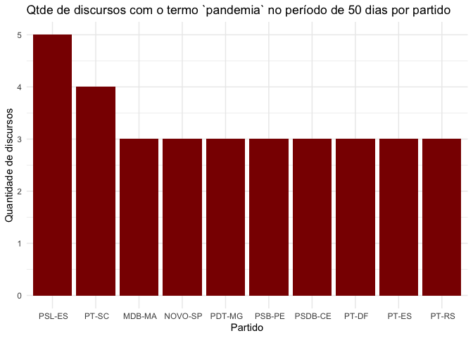

<!-- README.md is generated from README.Rmd. Please edit that file -->

# speechbr

<!-- badges: start -->
<!-- badges: end -->

## Overview

The goal of `{speechbr}` is to democratize access to the speeches of the
deputies, that is, their ideias and thoughts.

## Installation

You can install the development version of speechbr from
[GitHub](https://github.com/) with:

``` r
# install.packages("devtools")
devtools::install_github("dcardosos/speechbr")
#> Skipping install of 'speechbr' from a github remote, the SHA1 (a863015c) has not changed since last install.
#>   Use `force = TRUE` to force installation
```

## Example

This is a basic example which shows you how to solve a common problem:

``` r
library(speechbr)
library(ggplot2)

pandemic <- speechbr::speech_data("pandemia")
#> Warning: Expected 2 pieces. Missing pieces filled with `NA` in 1 rows [98].

pandemic %>% 
  dplyr::group_by(partido) %>% 
  dplyr::count(partido) %>% 
  dplyr::ungroup() %>% 
  dplyr::top_n(10, n) %>%
  ggplot(aes(reorder(partido, -n), n)) +
  geom_bar(stat = "identity", fill = "dark red") +
  theme_minimal() +
  labs(
    title = "Qtde de discursos com o termo `pandemia` no período de 50 dias por partido",
    x = "Partido",
    y = "Quantidade de discursos"
  )
```


