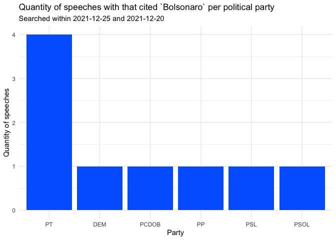

<!-- README.md is generated from README.Rmd. Please edit that file -->

# speechbr

<!-- badges: start -->
<!-- badges: end -->

## Overview

The goal of `{speechbr}` is to democratize access to the speeches of the
deputies, that is, their ideias and thoughts.

## Installation

You can install the development version of speechbr from
[GitHub](https://github.com/) with:

``` r
# install.packages("devtools")
devtools::install_github("dcardosos/speechbr")
```

## Example

An example of a base searching for the term “pandemia” (“pandemic”, in
English):

``` r
library(speechbr)
library(ggplot2)
library(magrittr)

pandemic <- speechbr::speech_data(
  keyword = "pandemia",
  reference_date = "2021-12-20",
  qtd_days = 5)

dplyr::glimpse(pandemic)
#> Rows: 98
#> Columns: 9
#> $ data             <date> 2021-12-17, 2021-12-17, 2021-12-17, 2021-12-17, 2021…
#> $ sessao           <chr> "33.2021.N", "33.2021.N", "33.2021.N", "33.2021.N", "…
#> $ fase             <chr> "ORDEM DO DIA", "ORDEM DO DIA", "ORDEM DO DIA", "ORDE…
#> $ discurso         <chr> "O SR. AGUINALDO RIBEIRO (PP - PB. Para discursar. Se…
#> $ orador           <chr> "AGUINALDO RIBEIRO", "FELIPE CARRERAS", "FERNANDA MEL…
#> $ partido          <chr> "PP-PB", "PSB-PE", "PSOL-RS", "PSOL-RJ", "NOVO-RJ", "…
#> $ hora             <chr> "19h24", "19h20", "14h36", "14h28", "14h12", "13h36",…
#> $ local_publicacao <chr> "DCD", "DCD", "DCD", "DCD", "DCD", "DCD", "DCD", "DCD…
#> $ data_publicacao  <date> 2021-12-18, 2021-12-18, 2021-12-18, 2021-12-18, 2021…
```

The default of function is search within 2021-12-26 and 2021-12-31. If
you want change this, use the arguments `reference_date` and `qtd_days`.

A simple application using the base:

``` r
pandemic %>% 
  dplyr::group_by(partido) %>% 
  dplyr::count(partido) %>% 
  dplyr::ungroup() %>% 
  dplyr::top_n(10, n) %>%
  ggplot(aes(reorder(partido, -n), n)) +
  geom_bar(stat = "identity", fill = "dark red") +
  theme_minimal() +
  labs(
    title = "Qtde de discursos com o termo `pandemia` no período de 50 dias por partido",
    x = "Partido",
    y = "Quantidade de discursos"
  )
```



### Example of a base

| data       | sessao    | fase         | discurso                                                                                                                                                                                                                                                                                                                                                                                                                                                                                                                                                                                                                                                                                                                                                                                                                                                                                                                                                                                                                                                                                                                                                                                                                                                                                                                                                                                                                                                                                                                                                                                                                                                                                                                                                                                                                                                                                                                                                                                                                                                                                                                                                                                                                                                                                                                                                                                                                                                                                           | orador            | partido | hora  | local_publicacao | data_publicacao |
|:-----------|:----------|:-------------|:---------------------------------------------------------------------------------------------------------------------------------------------------------------------------------------------------------------------------------------------------------------------------------------------------------------------------------------------------------------------------------------------------------------------------------------------------------------------------------------------------------------------------------------------------------------------------------------------------------------------------------------------------------------------------------------------------------------------------------------------------------------------------------------------------------------------------------------------------------------------------------------------------------------------------------------------------------------------------------------------------------------------------------------------------------------------------------------------------------------------------------------------------------------------------------------------------------------------------------------------------------------------------------------------------------------------------------------------------------------------------------------------------------------------------------------------------------------------------------------------------------------------------------------------------------------------------------------------------------------------------------------------------------------------------------------------------------------------------------------------------------------------------------------------------------------------------------------------------------------------------------------------------------------------------------------------------------------------------------------------------------------------------------------------------------------------------------------------------------------------------------------------------------------------------------------------------------------------------------------------------------------------------------------------------------------------------------------------------------------------------------------------------------------------------------------------------------------------------------------------------|:------------------|:--------|:------|:-----------------|:----------------|
| 2021-12-17 | 33.2021.N | ORDEM DO DIA | O SR. AGUINALDO RIBEIRO (PP - PB. Para discursar. Sem revisão do orador.) - Rapidamente, eu quero só aproveitar a fala do nosso eminente Deputado Felipe Carreras e também consignar, inclusive como Líder da Maioria no Congresso Nacional, que ontem, na reunião, representando a Maioria, ela se expressou de forma muito contundente na defesa da apreciação deste veto que trata do PERSE, que é exatamente a que se referiu o Deputado Felipe Carreras. Nós colocamos a nossa posição: não dá mais para não apreciar esta matéria, até porque estamos vendo que, pelo cenário que se avizinha, várias cidades já cancelaram eventos. Então, essa realidade vai se agravar, não vai melhorar a curto prazo.Por isso, é importante que este veto seja enfrentado logo na primeira sessão de fevereiro, pois foi o compromisso que fizemos, Presidente, com a maioria dos Líderes e com o Líder do Governo no Congresso, o Senador Eduardo Gomes. E isso foi acordado também com o Presidente Rodrigo Pacheco e com o Presidente Marcelo Ramos, que inclusive reafirmou no Senado Federal, mais cedo, exatamente a questão da retomada dos vetos.Então, eu queria só fazer esse registro, Presidente Marcelo Ramos, e agradecer aos Líderes, a V.Exa. pela condução dos trabalhos, aos nossos Presidentes Rodrigo Pacheco e Arthur Lira e, sobretudo, a todos os Líderes que, junto às suas bancadas, construíram um acordo para chegarmos nesta noite - e muitas pessoas duvidavam disso - e votarmos o que foi deliberado na tarde de hoje. Assim, queria felicitar V.Exa. pelo equilíbrio, pela serenidade e também pela firmeza na condução dos trabalhos.Quero aproveitar para desejar - como todos já o fizeram, neste clima natalino - um feliz Natal a todos! E o feliz ano novo nós deixamos para desejar na segunda-feira, quando ainda teremos sessão.                                                                                                                                                                                                                                                                                                                                                                                                                                                                                                                                                                                                                               | AGUINALDO RIBEIRO | PP-PB   | 19h24 | DCD              | 2021-12-18      |
| 2021-12-17 | 33.2021.N | ORDEM DO DIA | O SR. FELIPE CARRERAS (PSB - PE. Para discursar. Sem revisão do orador.) - Sr. Presidente e todos os que estão assistindo à sessão de forma virtual, eu estou Presidente da Frente Parlamentar Mista em Defesa da Produção Cultural e Entretenimento, um desafio que nos foi colocado por todo esse setor no Brasil, que inclui o turismo.Este Congresso Nacional, que hoje realiza esta sessão, aprovou por ampla maioria, praticamente por unanimidade, o Programa Emergencial de Retomada do Setor de Eventos - PERSE. Infelizmente, nós não teremos a derrubada do veto sobre este tema. São impressionantes os acordos feitos! Simplesmente nós não teremos a derrubada deste veto, tão esperada pelo setor que indiscutivelmente foi e está sendo o mais penalizado no Brasil. Eu quero demonstrar minha insatisfação com essa grande injustiça, em nome de todos os produtores e de todas as produtoras de eventos, em nome de toda a classe artística brasileira, em nome de todo o trade turístico brasileiro, porque o Governo virou as costas para esse setor. Eu tenho certeza de que, se for cumprido o compromisso, no início de fevereiro, Deputado Aguinaldo Ribeiro, nós teremos a derrubada desse veto. Este Congresso não vai virar as costas para esse setor. Quero, aqui na tribuna do Congresso Nacional, também em nome dos produtores e das produtoras de eventos do Brasil, fazer um agradecimento a uma grande guerreira, a Senadora Daniella Ribeiro. Ela tem sido uma guerreira, uma grande defensora de todo o setor no Senado Federal.Quero mandar um abraço ao Doreni Caramori, Presidente da Associação Brasileira dos Promotores de Eventos - ABRAPE, e parabenizá-lo pelo associativismo desse setor, que na pandemia demonstrou sua grande união em prol de temas importantes, para fazer justiça.Quero fazer um apelo neste momento em que estamos terminando o ano: que esse setor não seja esquecido. Esse setor é tratado, muitas vezes, com hipocrisia. Em muitos Estados, os produtores não vão conseguir fazer festa de réveillon. No carnaval, não se sabe o que está proibido, não se sabe se as pessoas vão poder trabalhar em eventos privados com controle, respeitando a vacinação, em eventos só para vacinados. Muita gente não sabe se vai haver eventos. Isso é um grande desrespeito.Aqui da tribuna da Casa do Povo eu lhes digo: saibam que vocês terão voz aqui no Congresso Nacional.Um grande abraço! Um bom Natal! Que Deus os abençoe! | FELIPE CARRERAS   | PSB-PE  | 19h20 | DCD              | 2021-12-18      |
